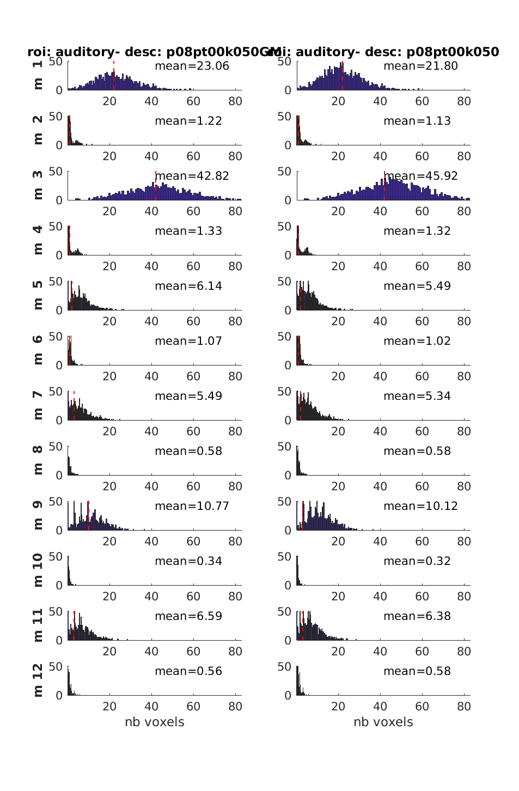
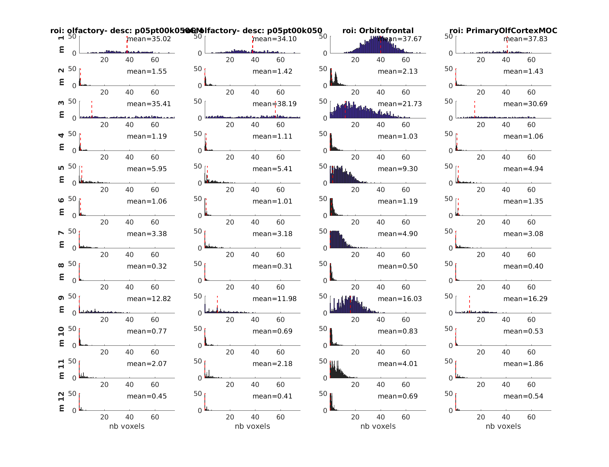
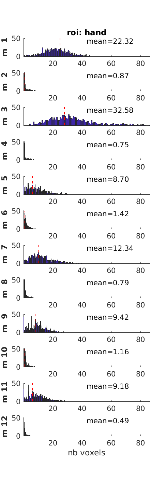
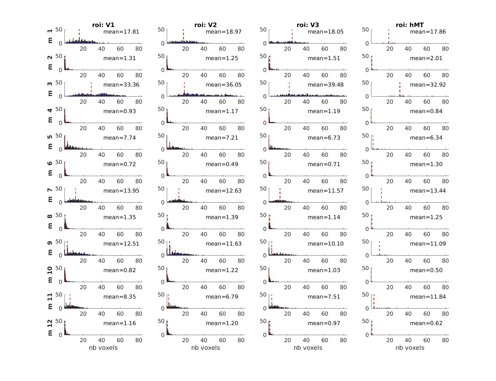

# fMRI analysis

## Copy and unzipping data

Run this script: `step_*_copy_data.m`

## Smoothing the data

Run this script: `step_*_smooth.m`

## Subject level GLMs

Run this script: `step_*_glm_subject.m`

## Model selection using the MACs toolbox

### Specify all models

`step_*_run_all_models` with `specify_only = true;`

All models include all experimental conditions (task, odor, nostril) and motion
parameters.

Models distinguish themselves by the HRF, extra confounds and scrubbing
regressors.

Note:

-   to allow for "vertical concatenation" of the design matrices of each runs
    regressors must be ordered in the same way and dummy regressors must be
    added when a given regressor does not exist
-   one current limitation for the scrubbing regressors generated by fmriprep is
    that even though they have the same "name" (for example motion-outlier01)
    they may actually censor a different time point are thus not equivalent even
    though they will be vertically concatenated.

#### HRF

-   HRF
-   HRF + temporal
-   HRF + temporal + dispersion

#### Confounds

-   None
-   CSF + WM

#### Scrubbing

-   no outlier removal
-   with outlier removal

1. No Derivative No Tissue Confounds No Scrubbing_model
2. No Derivative No Tissue Confounds With Scrubbing_model
3. No Derivative With Tissue Confounds No Scrubbing_model
4. No Derivative With Tissue Confounds With Scrubbing_model
5. Temporal Derivatives No Tissue Confounds No Scrubbing_model
6. Temporal Derivatives No Tissue Confounds With Scrubbing_model
7. Temporal Derivatives With Tissue Confounds No Scrubbing_model_L
8. Temporal Derivatives With Tissue Confounds With Scrubbing_model
9. Temporal Dispersion Derivatives No Tissue Confounds No Scrubbing_model
10. Temporal Dispersion Derivatives No Tissue Confounds With Scrubbing_model
11. Temporal Dispersion Derivatives With Tissue Confounds No Scrubbing_model
12. Temporal Dispersion Derivatives With Tissue Confounds With Scrubbing_model

### Compute cvLME and do bayesian model selection

This is done by `step_*_model_selection.m` using bayesian model selection with
the [MACs toolbox](https://github.com/JoramSoch/MACS/releases/tag/v1.3).

Datalad run command to be run from the root of the dataset

```bash
datalad run -d . -m 'compute cvLME missing model' \
    -o outputs/derivatives/cpp_spm-modelSelection/ \
    'cd code/src/analysis_func && make run_model_selection'
```

### Viewing winning models

With `step_2_model_selection_viz.m`

#### moddel 03: No Derivative With Tissue Confounds No Scrubbing


#### model 01: No Derivative No Tissue Confounds No Scrubbing.nii


Can also view the distribution across all the voxels in one ROI with
`step_2_model_selection_viz_roi.m`

Main results:

-   Model 1 (HRF, no denoising at all) seems better for olfactory regions
-   Model 3 (HRF with tissue confounds) seems better for visual / auditory
    regions






#### Failed cvLME

For `ctrl02`

```matlab
Subject 18 (18 out of 32):
   - Model No Derivative No Tissue Confounds No Scrubbing
```

## Running the group level GLM

`step_*_glm_group.m`

## Running the ROI based analysis

Can be done in native space to get time courses and percent signal change for
each ROIs

You will first need to create the ROIs (or you can download them from neurovault
(_insert URL_)) that will be used for this analysis.

`step_*_create_roi.m` create the ROIs to check responses in the regions
corresponding to the terms _hand_ and _olfactory_ in neurosynth and also for
visual ROIs from the Wang atlas.

This is done by `step_*_glm_subject_roi.m`

Percent signal changed are obtained with `step_*_glm_subject_roi_plot_psc.m`.
